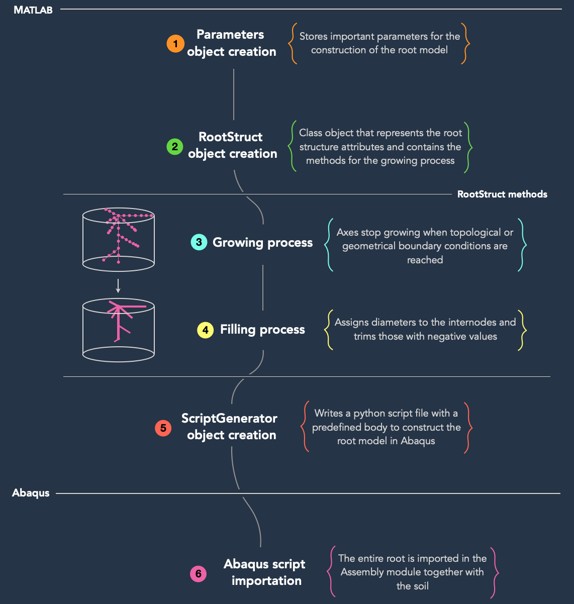
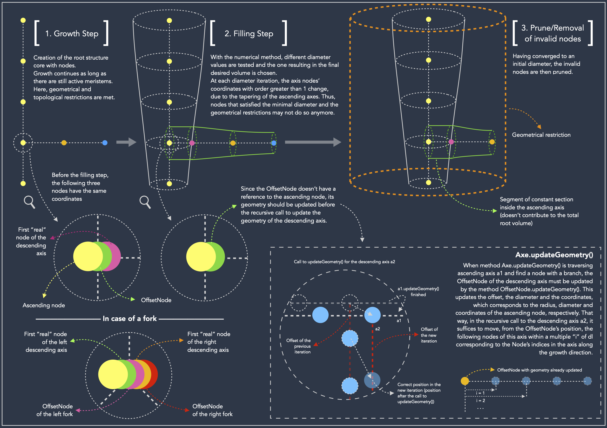
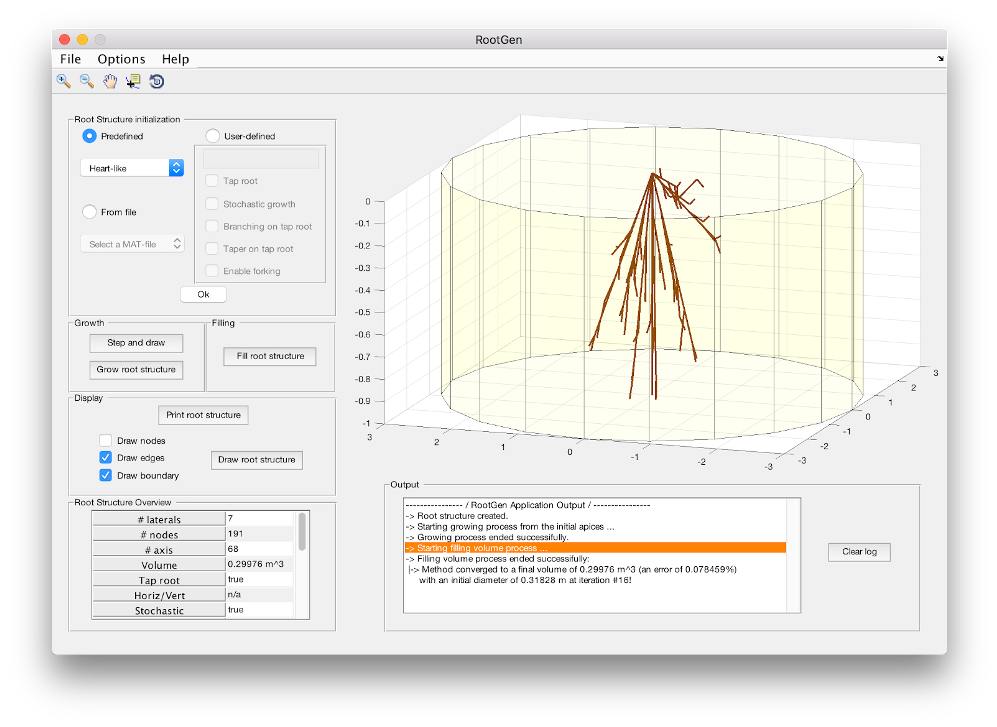
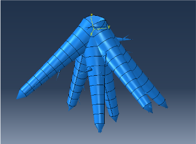
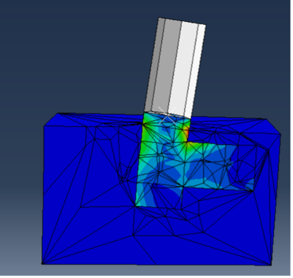

# Tree Root Modeling for Mechanical Analysis

## Abstract
This work developed a MATLAB software called RootGen for modeling tree roots for mechanical analysis. It generates 3D solids with geometries based on biological parameters of trees found on nature. Four morphological patterns were implemented for automatic generation. The tree is then imported automatically in a finite elements software.

## Introduction
Storms, erosions and other natural phenomena can damage the integrity of forests and isolated trees, affecting natural coverage and compromising the safety of buildings and people. The undertanding of the mechanisms of tree anchorage on soils can help avoid its uproot when undergoing these adversities [1].
Being an interdisciplinary work, a coherent biological modeling is essential to the representation of these structures.
This project was largely based on the work done by Dupuy [1,2] and has as final objective the possibility of performing static and dynamic analysis of the root and its interaction with the soil. An immediate application is the understanding of the transmissibility of vibrations, such as seismic waves spread by the soil through trees, and thus the potential use of forests as natural seismic metamaterials [3].

## Flow Chart for Root Generation
Figure 1 shows a simplified view of the steps required to export a root.

*Figure 1: Flow Chart for root generation*

Figure 2 shows a detailed explanation of some details needed to construct the root structure satisfying all the restrictions. For more information about the classes, check the [docs/README.md](docs/README.md).

*Figure 2: Detailed steps of the generation process*

## Results and Discussion
With morphology descriptions of certain root patterns presented in [1], RootGen was developed in MATLAB for creation of these by varying morphological parameters and geometric restrictions (Figure 3). The mathematical description of roots is given by graph theory, which are useful to represent branching, forking and growth. Is has been also developed a Python script that converts the resulting graph in a 3D solid inside the finite elements software Abaqus (Figure 4) so that static and dynamic simulations can be performed (Figure 5).

*Figure 3: RootGen - Creation of a Root of Heart Pattern*

*Figure 4: Example of root imported in Abaqus*

*Figure 5: Example of a simple simulation in Abaqus*

## Acknowledgements
This project was done under the supervision of Professor Josué Labaki, PhD., as part of the Scientific Initiation Program in the State University of Campinas (UNICAMP) in 2018. This work was funded with a scholarship from PRP/FAEPEX under the grant Fapesp 2017/01450-0.

## References
1. Dupuy L, Fourcaud T, Stokes A. A numerical investigation into the influence of soil type and root architecture on tree anchorage, Plant and Soil , 2005b, vol. 278 (pg. 119-134).
2. Dupuy L, Fourcaud T, Lac P, Stokes A (2007) A generic 3D finite element model of tree anchorage integrating soil mechanics and real root system architecture. Am J Bot 94:1506–1514
3. Colombi, A., Roux, P., Guenneau, S., Gueguen, P. & Craster, R. Forests as a natural seismic metamaterial: Rayleigh wave bandgaps induced by local resonances. Sci. Rep. 5, 19238 (2016).